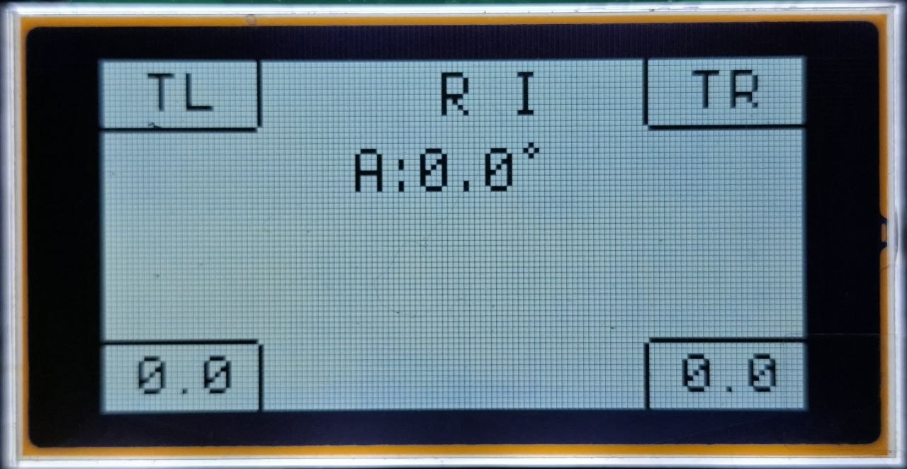

# SunTracker: ESP32-S3 Solar Tracking System

This project is a high-precision SunTracker built using an **ESP32-S3**, two infrared light sensors (with analog output), a stepper motor, and a graphic LCD display (ST7565R).



## 🚀 Features

- **Dynamic Tracking:** Automatically aligns with the strongest light source using two calibrated sensors.
- **Auto-Homing:** Automatically finds the "Zero" position at startup using a physical endstop (GPIO13).
- **Night Return:** Automatically returns the tracker to the "East" (position 0) when darkness is detected, preparing for sunrise.
- **Adaptive Backlight:** Dynamically adjusts display brightness (10% to 80%) based on ambient light levels to reduce glare at night.
- **Interactive UI:** Real-time display of:
  - Calibrated sensor values (BL/BR) in the corners.
  - Current rotation angle in degrees (e.g., `A:45.0°`).
  - Text-based status indicators (Terminus font):
    - **B** (Auto Backlight active)
    - **R** (Night Return active)
    - **I** (Inverted Colors active)
    - **E** (Endstop Triggered)
  - Movement direction indicators (`<<` and `>>`) flanking the angle value.
  - Homing status and system messages (e.g., `Homing...`, `Ready!`) centered on screen.
- **Configurable Limits:** Software-defined maximum rotation angle and gear ratio support.
- **In-App Calibration:** Adjust sensor offsets and tracking sensitivity (threshold) on the fly via Home Assistant or Web UI.

## 🛠 Hardware Requirements

- **Microcontroller:** ESP32-S3 (e.g., DevKitC-1).
- **Display:** ST7565R 128x64 Graphic LCD (SPI).
- **Motor:** NEMA 17 (or similar) with **A4988** or DRV8825 driver.
- **Sensors:** 2x IR/Photoresistor modules with **AO (Analog Output)**.
- **Endstop:** 1x Mechanical limit switch (Normally Open).

## 📌 Pin Mapping (ESP32-S3)

| Component | Pin | Function |
| :--- | :--- | :--- |
| **ST7565R SPI** | GPIO12 | SCK (Clock) |
| | GPIO11 | MOSI (Data) |
| | GPIO10 | CS (Chip Select) |
| | GPIO9 | DC (Data/Command) |
| | GPIO8 | RST (Reset) |
| | GPIO7 | Backlight (PWM) |
| **A4988 Stepper**| GPIO4 | STEP |
| | GPIO5 | DIR |
| | GPIO6 | SLEEP/ENABLE |
| **Sensors** | GPIO1 | Left Bottom Sensor (AO) |
| | GPIO2 | Right Bottom Sensor (AO) |
| **Endstop** | GPIO13 | Min Limit Switch (GND) |

## ⚙️ Configuration & Calibration

### 1. Gear Ratio (`Steps Per Degree`)
Set this value based on your mechanical setup. 
- Example: If your motor has 200 steps/rev and you use 16x microstepping with a 1:5 gear reduction:
  - `(200 * 16 * 5) / 360 = 44.4 steps/degree`.

### 2. Sensor Calibration
The sensors may have different physical characteristics.
1. Place the tracker under uniform lighting.
2. Observe `BL` and `BR` values on the screen.
3. Adjust **Left/Right Sensor Offset** until the displayed values are equal.

### 3. Drift Prevention (`Tracking Threshold`)
Adjust the **Tracking Threshold** to set a "deadband". A value of `0.05` to `0.15` is recommended to prevent the motor from jittering due to minor light fluctuations.

### 4. Night Return & Auto Backlight
- **Night Return:** When enabled, the tracker monitors raw voltage. If both sensors report > 3.0V (darkness), the system moves to position 0.
- **Auto Backlight:** Adjusts the ST7565R backlight based on the average light level of the sensors for a more comfortable experience.

## 📁 Project Structure

- `SunTracker.yaml`: Main ESPHome configuration.
- `tracker_logic.h`: Core tracking algorithm and math.
- `display_logic.h`: Helper functions for ST7565R drawing.
- `custom_components/st7565r/`: Specialized display driver.

## 🛠 Installation

1. Install [ESPHome](https://esphome.io/).
2. Copy `secrets.yaml` and fill in your WiFi credentials.
3. Run:
   ```bash
   esphome run SunTracker.yaml
   ```

---
*Note: This project uses inverted sensor logic (Lower voltage = Brighter light), typical for common IR photodiode modules.*
